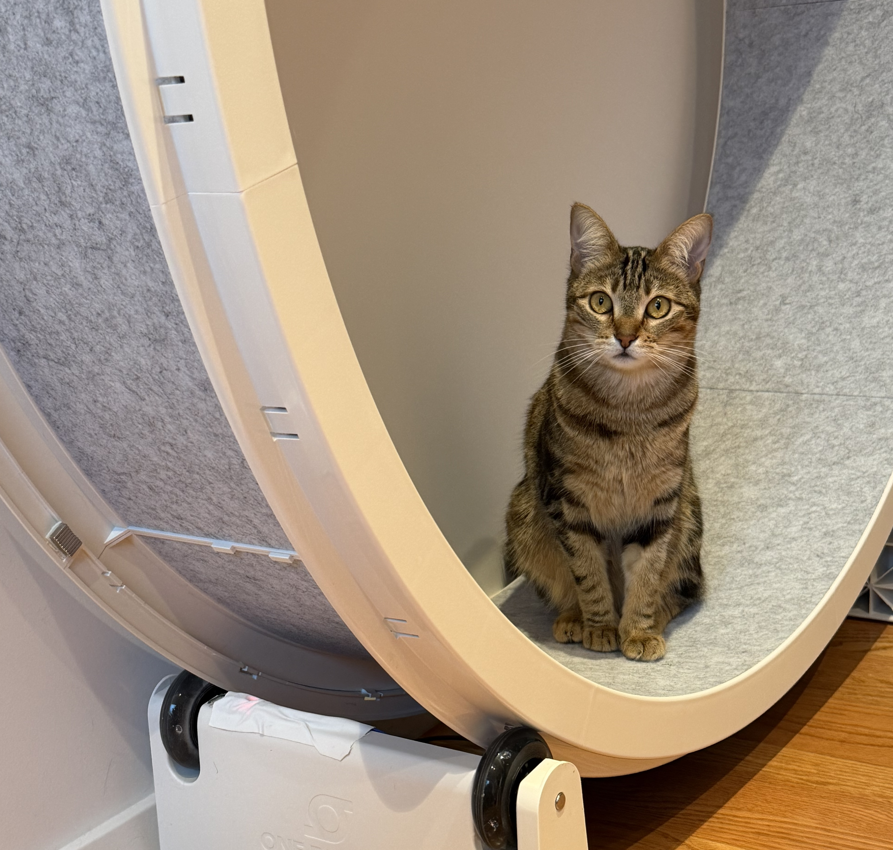
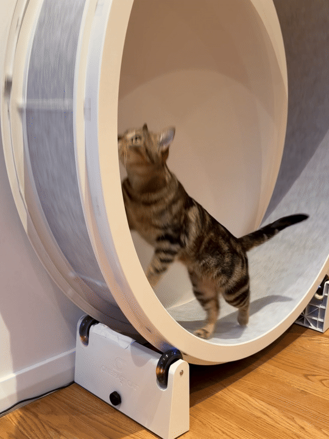
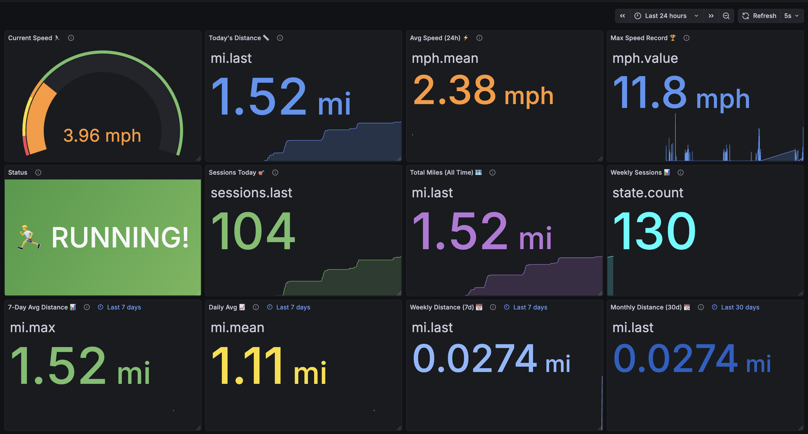
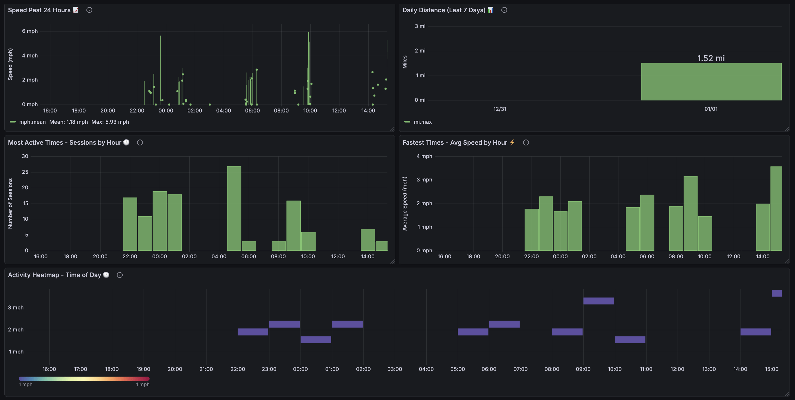

# Cat Wheel Activity Tracker

A Home Assistant + ESPHome project to monitor your cat's exercise wheel activity with real-time speed, distance, and session tracking.

> **Note:** This is a hobby project I built over the holiday break with the assistance of AI for troubleshooting, YAML optimization, and Grafana dashboard visualizations. I have two adopted tabbies who absolutely love their wheel and use it constantly. I wanted to better understand their exercise habits and follow along on their fitness journey! 🐱

## 📸 Project Photos

<p align="center">
  
  
</p>

<p align="center">
  
</p>
<p align="center"><em>Real-time dashboard showing current speed, distance, sessions, and activity status</em></p>

<p align="center">
  
</p>
<p align="center"><em>Historical analytics including speed trends, daily distance, and activity heatmaps by time of day</em></p>


## 🎯 Features

- **Real-time Speed Monitoring** - Displays current speed in mph with bounce detection
- **Distance Tracking** - Daily, weekly, monthly, and total odometer readings in miles
- **Session Tracking** - Counts running sessions and tracks duration (current, last, longest)
- **Max Speed Recording** - Records the fastest speed achieved
- **Activity Timeline** - Shows time since last wheel activity
- **Home Assistant Integration** - Full HA integration with automatic entity discovery
- **Persistent Storage** - Statistics survive power cycles
- **Optional Grafana Dashboards** - Time-series visualizations (requires InfluxDB)
- **Optional InfluxDB Backend** - Efficient time-series data storage

## 📋 Prerequisites

### Required Knowledge
- **Basic Electronics** - Familiarity with connecting components using wire and solder
- **Home Assistant Experience** - Basic understanding of HA integrations and configuration

### Required Hardware/Software
- **Home Assistant** - Latest version recommended
- **ESPHome** - Add-on installed in Home Assistant

### Optional (for data visualization)
- **InfluxDB** - Add-on or external instance (for time-series data storage)
- **Grafana** - Add-on or external instance (for dashboard visualization)

> **Note:** InfluxDB and Grafana are completely optional. The project works perfectly fine with just Home Assistant and ESPHome. You can view real-time data directly in Home Assistant's UI. InfluxDB + Grafana are only needed if you want historical data analysis and custom dashboards.

### Setup Guides

1. **ESPHome Integration** (Required)
   - [Home Assistant ESPHome Documentation](https://www.home-assistant.io/integrations/esphome/)
   - [ESPHome Getting Started Guide](https://esphome.io/guides/getting_started_command_line.html)

2. **InfluxDB Integration** (Optional)
   - [Home Assistant InfluxDB Documentation](https://www.home-assistant.io/integrations/influxdb/)
   - [InfluxDB Add-on Setup](https://github.com/hassio-addons/addon-influxdb)
   - Note: InfluxDB setup and configuration is beyond the scope of this guide

3. **Grafana Integration** (Optional)
   - [Home Assistant Grafana Add-on](https://github.com/hassio-addons/addon-grafana)
   - [Grafana InfluxDB Data Source Setup](https://grafana.com/docs/grafana/latest/datasources/influxdb/)
   - Note: Grafana setup and dashboard creation is beyond the scope of this guide

## 🛠️ Hardware

### Components Used in This Build
- **[Waveshare ESP32-S3 Development Board with 3.49" IPS Touch Display](https://www.amazon.com/dp/B0FQM41PGX)** - Microcontroller with display (note: display support not implemented in this version, so a basic ESP board will suffice)
- **[Reed Sensor Module Reed Switch Magnetic Switch for Arduino](https://www.amazon.com/dp/B0FR4CNLPX)** - Detects magnet passes
- **[Strong Magnets](https://www.amazon.com/dp/B0BCGDMMT8)** - Divided into 4 equal segments and affixed with double-sided tape
- **One Fast Cat Exercise Wheel** - Or compatible cat wheel
- **Soldering Iron & Solder** - For connecting components
- **Wire** - For connections between components

### Alternative Hardware
For a more cost-effective build, consider using the same boards as the inspiration projects:
- **ESP32-S3-DevKitC-1** - Basic microcontroller without display (simpler, cheaper)
- **Reed Switch Sensor Module** - Same as above
- **Strong Magnets** - Same as above

> **Note:** I initially purchased the Waveshare board with the integrated display but encountered compatibility issues with the display drivers in ESPHome. After troubleshooting in Arduino IDE and VSCode ESP-IDF, I decided to keep the project simple and use Grafana for visualization instead. If you're building this project and don't need a display, the basic ESP32-S3-DevKitC-1 is a more cost-effective option.

### Optional
- **USB Power Supply** - 5V for ESP32
- **Enclosure** - For protection and mounting

## 📦 Installation

### 1. Prepare Your Wheel

1. Measure the inner diameter of your wheel (use a laser measure for accuracy)
2. Calculate circumference: `π × diameter`
3. Divide by the number of magnets to get distance per magnet pass
   - Example: 1.08m diameter → 3.4m circumference ÷ 4 magnets = 0.85m per pass
4. Update the `wheel_circumference` value in the YAML

### 2. Hardware Setup

1. Connect the reed switch sensor to GPIO1 (INPUT_PULLUP)
2. Divide your magnet bars into equal segments (I used 4 segments)
3. Affix magnets evenly around the wheel's outer edge using double-sided tape
4. Mount the reed switch sensor close to (but not touching) the magnets
5. Power the ESP32 via USB

### 3. ESPHome Configuration

1. In Home Assistant, go to **Settings → Devices & Services → ESPHome**
2. Click **Create New Device**
3. Copy the contents of `catwheel.yaml` into the editor
4. Update the `secrets.yaml` with your WiFi credentials:
   ```yaml
   wifi_ssid: "Your WiFi SSID"
   wifi_password: "Your WiFi Password"
   fallback_password: "Fallback AP Password"
   ```
5. Click **Install** and select your ESP32 device
6. Wait for compilation and flashing to complete

### 4. Verify Home Assistant Integration

1. Go to **Settings → Devices & Services → Devices**
2. Find "One Fast Cat Wheel Speedo" device
3. Verify all entities are present:
   - Cat Wheel Speed (mph)
   - Distance Today (mi)
   - Weekly Distance (mi)
   - Monthly Distance (mi)
   - Cat Wheel Odometer (mi)
   - Max Speed (mph)
   - Sessions Today (count)
   - Current Session Duration (seconds)
   - Last Session Duration (seconds)
   - Longest Session (seconds)
   - Cat Running (binary sensor)
   - Last Movement (text sensor)
   - Reset Daily Stats (button)
   - Reset Weekly Stats (button)
   - Reset Monthly Stats (button)
   - Reset All Stats (button)

### 5. (Optional) Configure InfluxDB

If you want to use InfluxDB for data storage:

1. Ensure InfluxDB is installed and running
2. In Home Assistant, go to **Settings → Devices & Services → Create Integration**
3. Search for and add the **InfluxDB** integration
4. Configure the connection details (host, port, token, etc.)
5. In the InfluxDB integration settings, ensure the cat wheel entities are being recorded

For detailed InfluxDB setup instructions, refer to the [official Home Assistant InfluxDB documentation](https://www.home-assistant.io/integrations/influxdb/).

### 6. (Optional) Create Grafana Dashboard

If you're using Grafana with InfluxDB:

#### Quick Start - Import Pre-Built Dashboard

The easiest way to get started is to import the pre-built dashboard:

1. Open Grafana (usually at `http://homeassistant.local:3000`)
2. Go to **Dashboards → New → Import**
3. Copy the contents of `catwheel-grafana-dashboard.json` from this repository
4. Paste it into the "Import via panel json" field
5. Click **Load**
6. Select your InfluxDB data source
7. Click **Import**

The dashboard includes:
- Real-time speed gauge
- Daily, weekly, monthly, and total distance stats
- 7-day average distance and alternative daily average
- Session tracking (count, current duration, last duration, longest record)
- Activity status and time since last movement
- Speed trends over 24 hours
- Daily distance bar chart
- Most active times by hour (sessions)
- Fastest times by hour (average speed)
- Activity heatmap by time of day
- Weekly session trends

#### Manual Dashboard Creation

If you prefer to create a dashboard from scratch:

1. Open Grafana (usually at `http://homeassistant.local:3000`)
2. Ensure InfluxDB is added as a data source
3. Create a new dashboard with the following panels:

| Panel | Type | Purpose |
|-------|------|---------|
| Current Speed | Gauge | Real-time speed display |
| Today's Distance | Stat | Today's total distance |
| Avg Speed (24h) | Stat | Average speed last 24 hours |
| Max Speed Record | Stat | Personal record |
| Status | Stat | Current activity status |
| Sessions Today | Stat | Running sessions today |
| Total Miles | Stat | Lifetime distance |
| Weekly Sessions | Stat | Sessions this week |
| 7-Day Avg Distance | Stat | Average daily distance over 7 days |
| Daily Avg | Stat | Alternative daily average |
| Weekly Distance (7d) | Stat | Sum of past 7 days |
| Monthly Distance (30d) | Stat | Sum of past 30 days |
| Last Movement | Stat | Time since last activity |
| Current Session | Stat | Live session duration |
| Last Session Duration | Stat | Previous session length |
| Longest Session | Stat | All-time record |
| Speed Past 24 Hours | Time Series | Speed trends |
| Daily Distance | Bar Chart | Distance per day |
| Most Active Times | Bar Chart | Sessions by hour |
| Fastest Times | Bar Chart | Avg speed by hour |
| Activity Heatmap | Heatmap | Activity by time of day |
| Sessions Per Day | Time Series | Daily session count |

#### Sample Grafana Queries

**Current Speed:**
```sql
SELECT last("value") FROM "catwheel_speed_sensor" WHERE time > now() - 1h
```

**Daily Distance:**
```sql
SELECT last("value") FROM "catwheel_distance_today" WHERE time > now() - 24h
```

**Weekly Sessions:**
```sql
SELECT last("value") FROM "catwheel_sessions_today" 
WHERE time > now() - 7d GROUP BY time(24h)
```

**Average Speed During Sessions:**
```sql
SELECT mean("value") FROM "catwheel_speed_sensor" 
WHERE "value" > 0.45 AND time > now() - 24h
```

**Activity by Hour of Day:**
```sql
SELECT count("value") FROM "catwheel_cat_running" 
WHERE "value" = 'true' AND time > now() - 30d 
GROUP BY time(1h)
```

**Most Active Times (Sessions by Hour):**
```sql
SELECT count("value") FROM "state" 
WHERE ("entity_id" = 'one_fast_cat_wheel_speedo_cat_running' AND "value" = 1) 
AND $timeFilter GROUP BY time(1h)
```

**Fastest Times (Avg Speed by Hour):**
```sql
SELECT mean("value") FROM "mph" 
WHERE "entity_id" = 'one_fast_cat_wheel_speedo_cat_wheel_speed' 
AND "value" > 0.45 AND $timeFilter GROUP BY time(1h)
```

## ⚙️ Configuration

### Wheel Calibration

The most important configuration is the wheel circumference. Measure carefully:

1. Use a laser measure or measuring tape to find the inner diameter
2. Calculate: `circumference = π × diameter`
3. Divide by number of magnets: `distance_per_magnet = circumference / magnet_count`
4. Update in YAML:
   ```yaml
   substitutions:
     wheel_circumference: "0.9582"  # Your calculated value
   ```

### Sensor Tuning

Adjust these values based on your setup:

- **bounce_threshold_ms** (default: 150ms)
  - Increase if you see false speed spikes
  - Decrease if magnet passes are being missed

- **speed_timeout_ms** (default: 5000ms)
  - Time before speed resets to 0 after last magnet pass
  - Increase if you want speed to persist longer

- **max_speed_limit_mph** (default: 20.0 mph)
  - Reject speeds above this value (error detection)
  - Adjust based on your cat's maximum speed

- **running_threshold_mph** (default: 0.45 mph)
  - Speed threshold to consider cat "running"
  - Lower for more sensitive session detection

- **session_cooldown_ms** (default: 30000ms / 30 seconds)
  - Prevents counting brief pauses as separate sessions
  - If cat pauses less than this time, it resumes the same session
  - If cat pauses longer than this time, it counts as a new session
  - Increase if your cat does "stop-and-go" running to avoid inflated session counts

## 🐛 Troubleshooting

### No Speed Readings
- Check that reed switch is properly connected to GPIO1 (or the pin you used, if different)
- Verify magnet spacing is even around wheel
- Ensure reed switch is positioned close to magnets (you'll see a light flash when this happens)
- Test with manual magnet passes to verify sensor response
- Check ESPHome logs for sensor activity

### False Speed Spikes
- Increase `bounce_threshold_ms` value
- Check magnet alignment and spacing
- Verify reed switch is not vibrating

### Speed Resets Too Quickly
- Increase `speed_timeout_ms` value
- Check for loose connections

### Data Not Appearing in Grafana
- Verify InfluxDB integration is enabled in Home Assistant
- Check that entities are being recorded (Settings → Devices & Services → InfluxDB)
- Verify Grafana data source is configured correctly
- Check Grafana logs for connection errors
- Ensure InfluxDB is receiving data from Home Assistant

### Sessions Not Counting
- Verify `running_threshold_mph` is appropriate for your cat's speed
- Check "Cat Running" binary sensor in Home Assistant
- Review ESPHome logs for session start/end messages

### Session Count Too High (Stop-and-Go Behavior)
- If your cat frequently pauses during running, brief stops may be counted as new sessions
- Increase `session_cooldown_ms` value (default: 30000ms / 30 seconds)
- Try 60000ms (60 seconds) or higher for cats with stop-and-go running style
- Check ESPHome logs to see "Resuming session" vs "Session started" messages

## 📊 Understanding the Data

### Entities Explained

- **Cat Wheel Speed** - Current speed in mph (updates on each magnet pass)
- **Distance Today** - Total distance traveled today in miles (resets at midnight)
- **Weekly Distance** - Distance traveled in past 7 days (manual reset required)
- **Monthly Distance** - Distance traveled in past 30 days (manual reset required)
- **Cat Wheel Odometer** - Total distance since first use in miles (never resets)
- **Max Speed** - Highest speed recorded today (resets at midnight)
- **Sessions Today** - Number of running sessions detected today (resets at midnight). Uses 30-second cooldown to avoid counting brief pauses as separate sessions
- **Current Session Duration** - Live timer showing duration of active session (seconds)
- **Last Session Duration** - How long the previous session lasted (seconds)
- **Longest Session** - All-time record for longest running session (seconds)
- **Cat Running** - Binary sensor indicating active running (speed > 0.45 mph)
- **Last Movement** - Human-readable time since last magnet pass (e.g., "5m ago")

### Data Persistence

All statistics are stored in the ESP32's flash memory and survive power cycles:
- `distance_today_val` - Resets at midnight
- `distance_week_val` - Manual reset using "Reset Weekly Stats" button
- `distance_month_val` - Manual reset using "Reset Monthly Stats" button
- `distance_total_val` - Never resets (true odometer)
- `speed_max_val` - Resets at midnight
- `session_count_today` - Resets at midnight
- `last_session_duration` - Persists across power cycles
- `longest_session_duration` - Never resets (all-time record)

### Viewing Data in Home Assistant

Without InfluxDB/Grafana, you can still view all data directly in Home Assistant:

1. Go to **Settings → Devices & Services → Devices**
2. Select the "One Fast Cat Wheel Speedo" device
3. View all entities and their current values
4. Create custom Home Assistant cards/dashboards using the entities
5. Set up automations based on the "Cat Running" binary sensor

## 🚀 Future Improvements

The following enhancements are planned:

1. **Directional Movement Detection**
   - Add second reed sensor to detect wheel direction
   - Track forward vs backward rotation separately

2. **Rocking Detection**
   - Improve metrics to eliminate false positives from wheel rocking
   - Distinguish between actual running and wheel movement

3. **Advanced Analytics**
   - Calorie burn estimation
   - Activity patterns and trends
   - Comparison with historical data

## 📚 Inspiration & Credits

This project builds upon the work of:

- **[Sarah Dalrymple](https://sarahdal.github.io/arduino-esp32/2025/02/11/CatWheel.html)** - Original Arduino-based cat wheel speedometer concept and hardware design

- **[DJ Benson](https://github.com/DJBenson/ha-stuff/blob/main/esphome/devices/cat-wheel/README.md)** - ESPHome implementation with Home Assistant integration and advanced features

I combined the best ideas from both projects and added:
- Enhanced bounce detection and speed validation
- Weekly and monthly distance tracking
- Session duration tracking (current, last, longest)
- Session cooldown timer to prevent counting brief pauses as separate sessions
- Activity timeline (time since last movement)
- Optional InfluxDB + Grafana integration with pre-built dashboard
- Comprehensive documentation and configuration examples

## 🔗 Project Repository

This project is open source and available on GitHub:
**[github.com/seakitteh/catwheel](https://github.com/seakitteh/catwheel)**

Feel free to fork, contribute, or use it as inspiration for your own projects!

## ☕ Support This Project

If you found this project helpful and want to say thanks, you can [buy me a coffee](https://buymeacoffee.com/seakitteh)

## 📝 License

MIT License - Feel free to adapt and improve this project for your own needs!

## 🤝 Contributing

Found an improvement or have a suggestion?

- Report issues or suggest features
- Submit pull requests with improvements
- Share your Grafana dashboard configurations
- Help improve documentation

---

**Project Status:** Active - Monitoring Missy and Shakira on their wheel adventures! 🐱🐱

**Originally Tested On:**
- Home Assistant 2025.12.5
- ESPHome 2025.12.4
- InfluxDB 5.0.2 (optional)
- Grafana 12.1.0 (optional)
